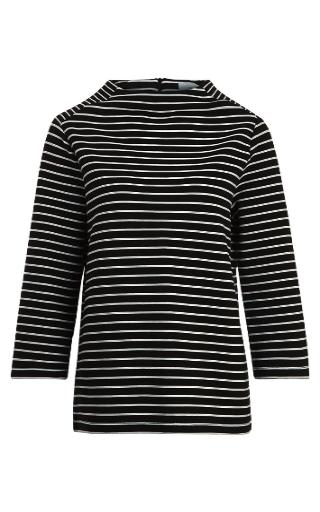
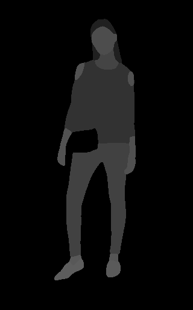
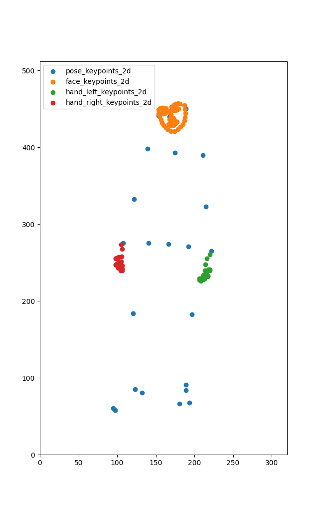
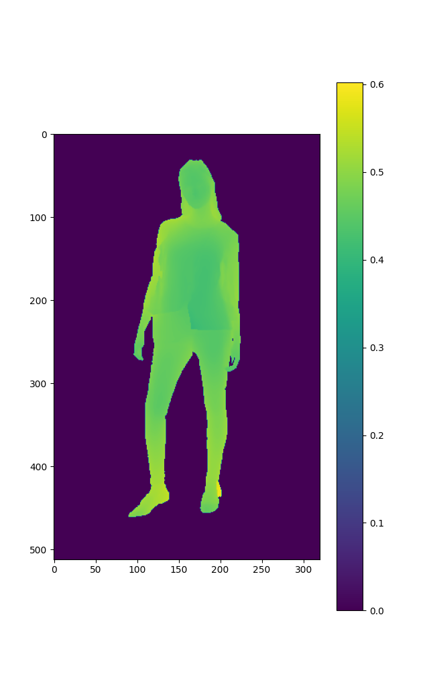

# Data

This includes our data, and data from the M3D-VTON demo.

<table>
  <tr>
    <td>Folder</td>
    <td>Source</td>
    <td>Description</td>
    <td>Requirements</td>
    <td>Example</td>
  </tr>
  <tr>
    <td>Cloth</td>
    <td>Input</td>
    <td>In-shop clothing image</td>
    <td>Image with resolution 320*512, JPG</td>
    <td></td>
  </tr>
  <tr>
    <td>Cloth Mask</td>
    <td>https://www.remove.bg/ + Cloth</td>
    <td>Mask of clothing</td>
    <td>Image with resolution 320*512, JPG</td>
    <td></td>
  </tr>
  <tr>
    <td>Image</td>
    <td>Input</td>
    <td>Frontal person image</td>
    <td>Image with resolution 320*512</td>
    <td></td>
  </tr>
  <tr>
    <td>Image Parse</td>
    <td>2D Human Parsing + Image </td>
    <td>human segmentation layout</td>
    <td>Image with resolution 320*512</td>
    <td></td>
  </tr>
  <tr>
    <td>Pose</td>
    <td>OpenPose + Image </td>
    <td>human joints & keypoints</td>
    <td>json</td>
    <td></td>
  </tr>


  <tr>
    <td>Palm Mask</td>
    <td>M3D-VTON/util/data_preprocessing.py + Image</td>
    <td>Generates mask for hands</td>
    <td>Image with resolution 320*512</td>
    <td></td>
  </tr>

  <tr>
    <td>Image Sobel</td>
    <td>M3D-VTON/util/data_preprocessing.py + Image</td>
    <td>Sobel gradients in the X and Y direction for each Image</td>
    <td>2 Images with resolution 320*512</td>
    <td></td>
  </tr>


  <tr>
    <td>Depth</td>
    <td>? I'm hoping this is generated by the MTM model, it's not mentioned anywhere in preprocessing</td>
    <td>depth values for front and back of image</td>
    <td>export of raw numpy arrays</td>
    <td></td>
  </tr>
</table>

## test_pairs.txt

This connects cloth (clothing articles) with images (human poses)

eg
```
ZX121DA0E-Q11@6=person_whole_front.png    THJ21D007-H11@10=cloth_front.jpg
BJ721E05W-J11@9=person_whole_front.png    SO821D03A-Q11@12=cloth_front.jpg
```
